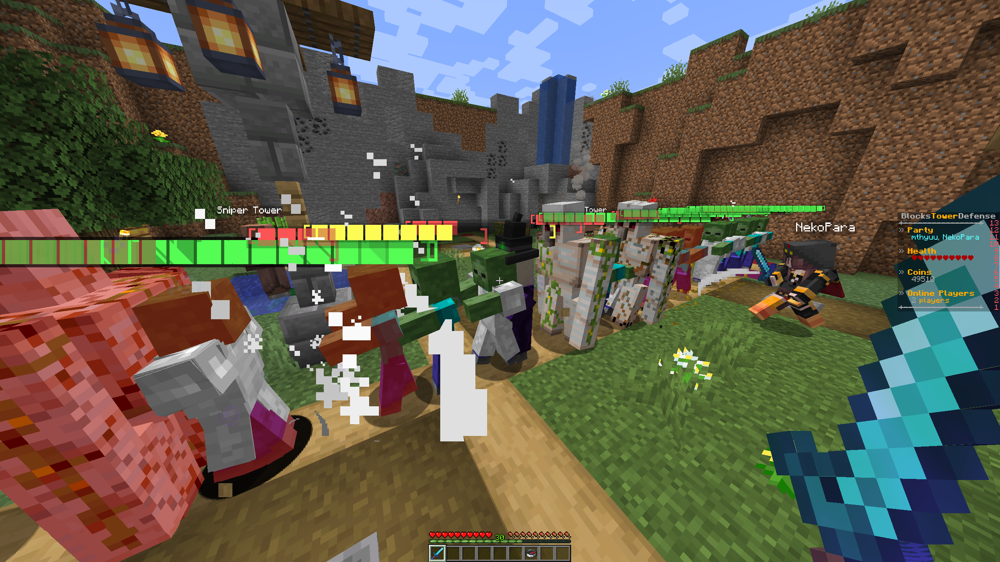

# Introduction to Senior Capstone - KSU Blocks Tower Defense 

Welcome to our team's Senior Capstone Project! This is the location of all related documentation and artifacts.

This is a Paper-based Minecraft plugin that implements a Bloons-Tower-Defense-like gamemode.

## Meet Our Team

**01-T2-Minecraft Game Mode**

**CS 4850 - Section 03/04/05 - Spring 2025**

### Programming/Development
* __[Matthew Elledge](https://github.com/mthyuu)__
* __[Logan Slicker](https://github.com/SlickerLogan)__ 
### Documentation
* __[Bryan Nguyen](https://github.com/BunnyCatCat)__
### Design
* __[Ashley Ahn](https://github.com/ashjuno)__
* __[AnnaGrace Gwee](https://github.com/annagracehowell)__
### Advisor & Professor
* Sharon Perry
### Sponsor
* Norman Reid (KSU Minecraft Server)

## Final Report
* [(WIP) Final Report - 2025 April 27th]()
* [(WIP) Final Presentation Video - 2025 April 27th]()

## Artifacts
* [Project Selection - 2025 January 15th](ReadMeFiles/01-T2-Minecraft-Selection.pdf)

* [Project Plan & Gantt Chart - 2025 January 26th](ReadMeFiles/01-T2-Minecraft-ProjectPlan.pdf)

* [Design (SDD) - 2025 February 2nd](ReadMeFiles/01-T2-Minecraft-Design.pdf)

* [Requirements (SRS) - 2025 February 2nd](ReadMeFiles/01-T2-Minecraft-Requirements.pdf)

* [Development - 2025 March 9th](ReadMeFiles/01-T2-Minecraft-Development.pdf)

* [Presentation - 2025 March 27th](ReadMeFiles/01-T2-Minecraft-Game-Mode-Presentation_No_Video.pdf)

* [Software Test Plan & Report (STP & STR) - 2025 March 30th](ReadMeFiles/01-T2-Minecraft-STP.pdf)

## Development Timeline
* [Gantt Chart - 2025 April 13th](ReadMeFiles/01-T2-Minecraft-GanttChart-Estimate.pdf)

* [Game Design Document - 2025 February 10th](ReadMeFiles/01-T2-MTD_Game_Design_Document.pdf)

* [Milestone 1 - 2025 February 10th](ReadMeFiles/01-T2-Minecraft-Game-Mode-Milestone-1.pdf)

* [Milestone 2 - 2025 March 17th](ReadMeFiles/01-T2-Minecraft-Tower-Defense-Milestone-2.pdf)

* [Milestone 3 - 2025 April 13th](ReadMeFiles/01-T2-Minecraft-Tower-Defense-Milestone-3.pdf)

## C-Day Files
* [Poster-UC-027.pdf](ReadMeFiles/Poster-UC-027.pdf)
  * [Poster-UC-027.pptx](ReadMeFiles/Poster-UC-027.pptx)

* [Video-UC-027.mp4](https://youtu.be/sPDZEfjx5hA)

* [Flash-UC-027.mp4](https://youtu.be/HNO0LYXZMiw)

## Architectural Drawings
> Preview

* [Architectural Drawings - Full Quality PNG](https://github.com/KsuBlocksTD/BlocksTD1.0/tree/f0ee32bd2c42d54f4e730289dc98a232994c376e/ReadMeFiles/ArchitecturePNG)

* [Architectural Drawings - PlantUML Text](https://github.com/KsuBlocksTD/BlocksTD1.0/tree/f0ee32bd2c42d54f4e730289dc98a232994c376e/ReadMeFiles/ArchitectureText)

## Resources
### Dependencies
* __[PartiesAPI Plugin](https://alessiodp.com/parties)__
* __[PlaceholderAPI Plugin](https://www.spigotmc.org/resources/placeholderapi.6245)__
* __[SimpleScore Plugin](https://www.spigotmc.org/resources/simplescore-animated-scoreboard.23243)__ __- (Only required if not using a custom scoreboard)__
### All Resources
* __[IntelliJ Community Edition](https://www.jetbrains.com/idea/download/?section=windows)__
* __[IntelliJ Minecraft Development Plugin](https://plugins.jetbrains.com/plugin/8327-minecraft-development)__
* __[Spigot Development Guide](https://www.spigotmc.org/wiki/spigot-plugin-development)__
* __[Paper Development Guide](https://docs.papermc.io/paper/dev)__
* __[GitHub](https://github.com)__
* __[PartiesAPI Plugin](https://alessiodp.com/parties)__
* __[PlaceholderAPI Plugin](https://www.spigotmc.org/resources/placeholderapi.6245)__
* __[WorldEdit Plugin](https://modrinth.com/plugin/worldedit)__
* __[SimpleScore Plugin](https://www.spigotmc.org/resources/simplescore-animated-scoreboard.23243)__
* __[PlantUML](https://plantuml.com/)__
